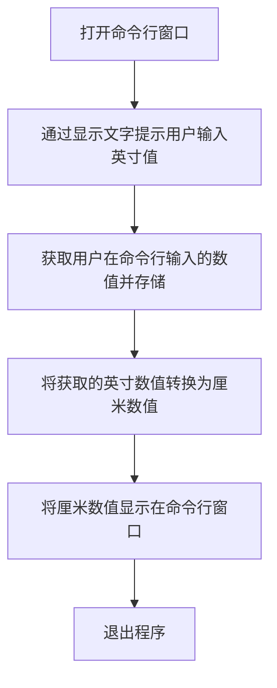

# 1.13.1 将英寸转换为厘米的程序

## 程序目标

获取来自用户输入的英寸值并将其转化为厘米值后返回给用户。

## 程序设计

```mermaid
    graph TD;
I[打开命令行窗口]
II[通过显示文字提示用户输入英寸值]
III[获取用户在命令行输入的数值并存储]
IV[将获取的英寸数值转换为厘米数值]
V[将厘米数值显示在命令行窗口]
VI[退出程序]

I --> II --> III --> IV --> V --> VI
```
