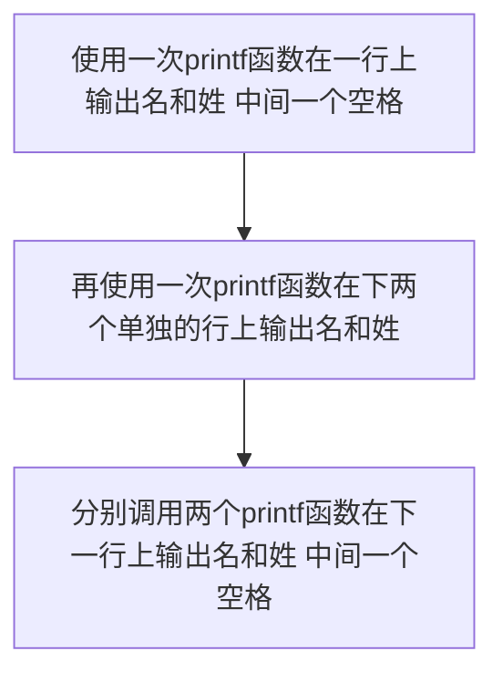

# 按照特定方式调用printf()函数输出姓名的程序

## 程序目标

按照题目要求的方式调用printf()函数输出姓名

## 程序设计

```mermaid
    graph TD
    I --> II --> III

    I[使用一次printf函数在一行上输出名和姓 中间一个空格]
    II[再使用一次printf函数在下两个单独的行上输出名和姓]
    III[分别调用两个printf函数在下一行上输出名和姓 中间一个空格]
```